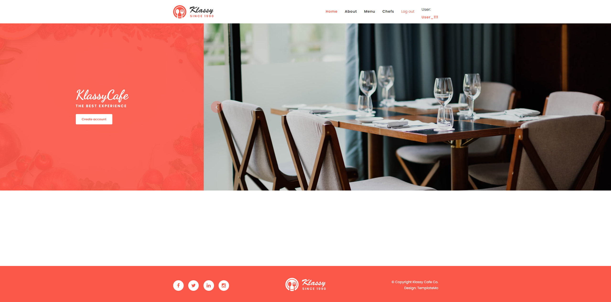

# Kitchen project

Django project for work with dish and cooks

## Check it out!

[Kitchen project deployed to Render](https://kitchen-restaurant-service.render.com/)

## Installation

Python3 must be already installed

```shell
git clone https://github.com/AntonSkyrda/kitcher-restaurant-service.git
cd kitcher-restaurant-service
python3 -m venv venv
source venv/bin/activate
pip install requirements.txt
python manage.py runserver
```

## Features

* Authentication functionality for User
* Power admin panel for managing dish and cooks

## Demo

